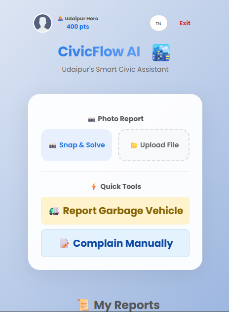
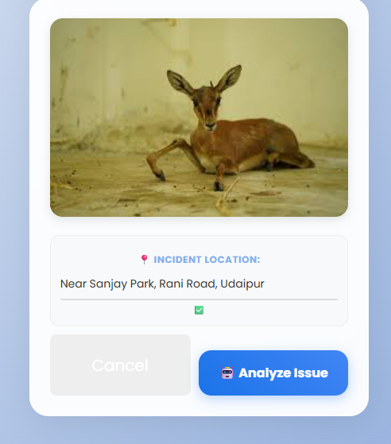
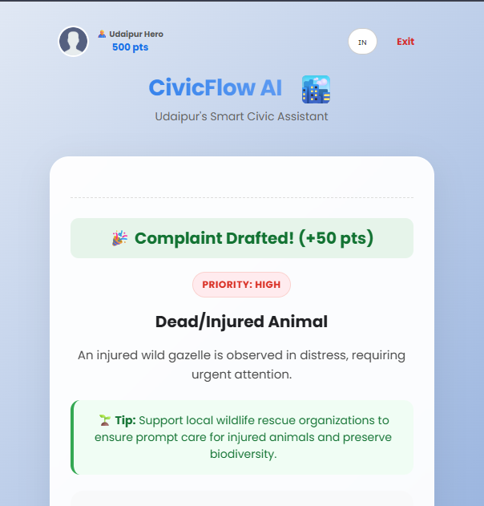
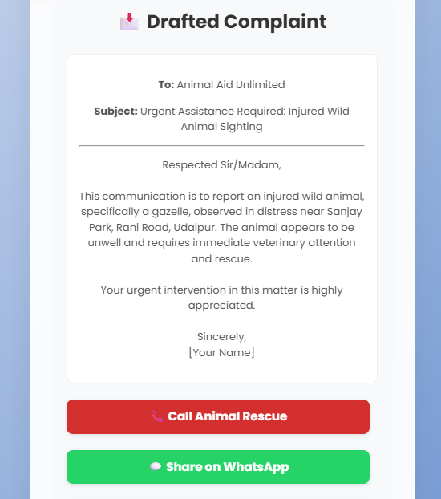
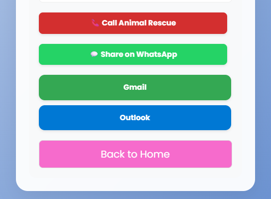
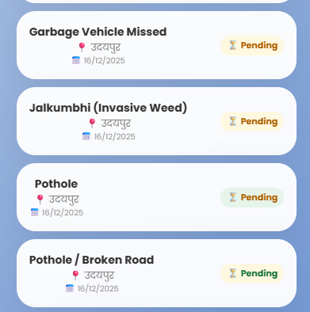

# 🏙️ CivicFlow AI

CivicFlow AI is a smart, AI-powered civic assistance platform designed to help citizens easily report public issues, receive intelligent guidance, and engage more actively with civic systems.

Built with a strong focus on accessibility, user engagement, and real-world usability, CivicFlow AI makes civic reporting faster, smarter, and more inclusive.

Try it out now!! 👉
https://civicflow-ai.vercel.app

---

## 🚀 Key Features

### 📸 Snap & Solve (AI-Powered)
- Users can capture or upload a photo of a civic issue.
- AI analyzes the image and provides **instant guidance or resolution suggestions**.
- Reduces manual effort and speeds up problem identification.

---

### 📝 Manual Complaint System
- Users can submit complaints manually using a **simple and guided interface**.
- Designed to be user-friendly for all age groups.

---

### 🎤 Tap to Speak (Voice Input)
- Manual complaint feature includes **Tap-to-Speak** functionality.
- Users can dictate complaints using voice instead of typing.
- Improves accessibility and overall user experience.

---

### 🗑️ Garbage Vehicle Absence Reporting
- Dedicated option to report **missed or delayed garbage collection vehicles**.
- Helps address one of the most frequent civic issues efficiently.

---

### 🏆 User Engagement & Point System
- Users earn **points for reporting issues and active participation**.
- Gamification encourages responsible civic engagement.
- Example badge system like *“Udaipur Hero – 500 pts”*.

---

### 🌐 Hindi Language Support
- Supports **Hindi language** to make the platform accessible to local users.
- Helps reduce language barriers in civic reporting.

---

### 📤 Multi-Channel Sharing & Contact
- Users can share complaints or reach authorities via:
  - 📞 Direct Call
  - 💬 WhatsApp
  - 📧 Gmail
  - 📮 Outlook
- Enables quick communication and wider reach.

---

### 💾 Saved Reports & Status Tracking
- All submitted reports (Snap & Solve or Manual) are **securely saved**.
- Users can view past complaints in the **“My Reports”** section.
- Each report shows:
  - 📍 Location
  - 📅 Date of submission
  - ⏳ Status (e.g., Pending)
- Ensures transparency and allows users to track issues over time.

---

## 📸 Screenshots

### 🏠 Main Dashboard


### 📸 Snap & Solve Feature






### 📂 My Reports & Status Tracking


---

## 🛠️ Tech Stack

### Frontend
- React
- Vite
- HTML, CSS, JavaScript

### Backend
- Node.js
- Express.js

### AI & APIs
- Gemini AI API
- Location & Maps services (optional)

---

## 📁 Project Structure
civicflow-ai/
├── frontend/
├── backend/
├── screenshots/
├── .gitignore
├── package.json
├── package-lock.json
└── README.md


---

## ⚙️ Installation & Setup

### Backend Setup
```bash
cd backend
npm install
```

## Create a .env file inside the backend folder:

```bash
GEMINI_API_KEY=your_api_key_here
PORT=5000
```


## Start the backend server:
```bash
node server.js
```

## Frontend Setup
```bash
cd frontend
npm install
npm run dev
```


### Open your browser and visit:
```bash
http://localhost:5173
```

## 🔒 Environment Variables

Sensitive information such as API keys is stored securely using environment variables and excluded from version control via .gitignore.

## 🌱 Future Enhancements

User authentication and profiles

Complaint history analytics

More regional language support

Mobile-first UI improvements

Cloud-based storage and dashboards

## 🤝 Contributions

Contributions, suggestions, and improvements are welcome.
Feel free to fork this repository and submit a pull request.

## 📄 License

This project is open-source and available under the MIT License.

## ❤️ Acknowledgement

Built with the vision of empowering citizens through technology and AI-driven civic engagement.

## ⭐ If you find this project useful, consider starring the repository!
